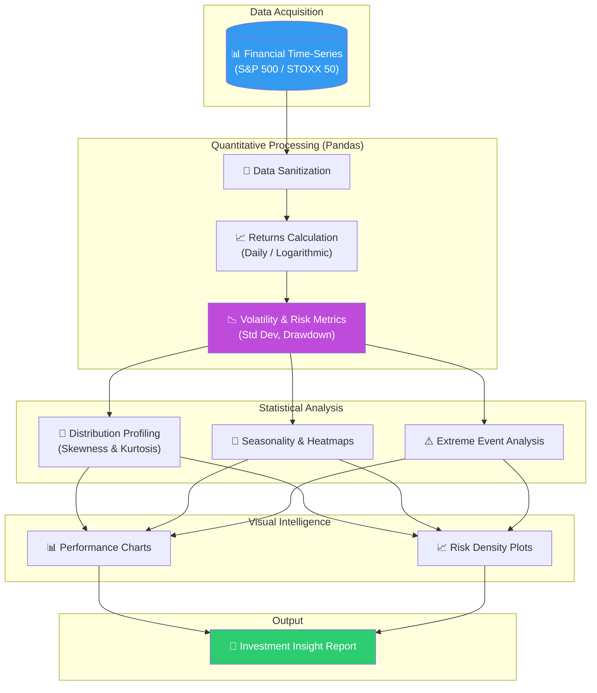
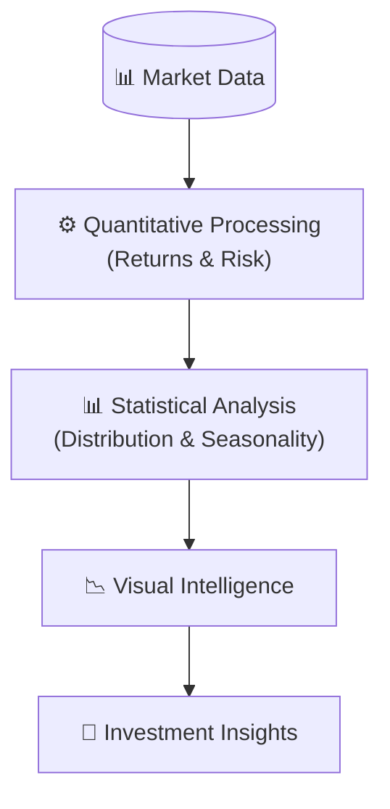

# 📈 MarketPulse: Quantitative Financial Analytics & Portfolio Risk Modeling

<p align="center">
  
  
  
  
  
</p>

**MarketPulse** è una piattaforma di analisi quantitativa progettata per il benchmarking e la valutazione del rischio di asset finanziari. Il progetto implementa una pipeline di analisi sistematica che confronta le performance storiche decennali di indici globali (S&P 500 vs EURO STOXX 50), estraendo insight critici su rendimenti corretti per il rischio, volatilità estrema e dinamiche di mercato macroeconomiche.

## 🏢 Valore Enterprise & Settori di Applicazione

| Settore / Ambito | Rilevanza & Benefici |
|-------------------|-----------|
| **Asset Management & Fintech** | Supporto alla costruzione di portafogli diversificati tramite analisi delle correlazioni e dei rendimenti storici. |
| **Risk Management** | Identificazione di scenari di "Fat Tails" e monitoraggio dei drawdown storici per lo stress-testing dei portafogli. |
| **Banking & FSI (Financial Services)** | Reporting avanzato delle performance di mercato e analisi della stagionalità per strategie di trading e investimento. |
| **Energy & Commodities** | Applicazione di tecniche di analisi time-series per il monitoraggio della volatilità dei prezzi dell'energia. |

---

## 🎯 Executive Summary & Valore di Business
MarketPulse trasforma dati di borsa grezzi in indicatori di rischio e performance azionabili per decisioni di allocazione del capitale.

### 🏛️ 1. Analisi Quantitativa e Profilazione del Rischio
* **Rendimenti Logaritmici:** Utilizzo di log-returns per garantire l'additività temporale e facilitare la modellazione statistica della volatilità.
* **Distribuzione e Code Grasse (Fat Tails):** Analisi della distribuzione dei rendimenti tramite Kernel Density Estimation (KDE), evidenziando l'asimmetria negativa (negative skew) tipica dei mercati finanziari durante i periodi di crisi.

### ⚙️ 2. Volatilità ed Eventi Estremi
* **Market Timing Analysis:** Studio dei "Best vs Worst Days" che dimostra come i giorni di maggiore rialzo seguano spesso i crolli più violenti, fornendo basi quantitative per strategie di investimento a lungo termine rispetto al market timing speculativo.
* **Stagionalità Mensile:** Implementazione di heatmap per identificare pattern ciclici annuali, utili per l'ottimizzazione dell'entrata e uscita dal mercato.

### 🛡️ 3. Architettura Modulare in Python
* **Separazione Logica-Analisi:** Il nucleo dei calcoli è incapsulato in moduli Python riutilizzabili, mentre i Jupyter Notebook sono dedicati esclusivamente alla narrativa dei dati e alla visualizzazione executive.

---

## 🏗️ Architettura della Pipeline Finanziaria



## 🛠️ Stack Tecnologico

| Layer | Tecnologia | Ruolo |
|:------|:-----------|:-----|
| 🐍 **Language** | Python 3.9+ | Core development |
| 🐼 **Data Ops** | pandas / NumPy | Financial Time-Series Management |
| 📊 **Visualization** | Matplotlib / Seaborn | Quantitative Plotting |
| 📓 **Environment** | JupyterLab | Interactive Analysis |

## 🚀 Setup

```bash
# Clone
git clone https://github.com/sylver86/13-performance-indici-azionari-python.git
cd 13-performance-indici-azionari-python

# Install
pip install -r requirements.txt

# Run
jupyter lab notebooks/main_analysis.ipynb
```

<br><br>

*Progettato e sviluppato da Eugenio Pasqua.*

---

# 🇬🇧 ENGLISH VERSION

# 📈 MarketPulse: Quantitative Financial Analytics & Portfolio Risk Modeling

<p align="center">
  
  
</p>

**MarketPulse** is a quantitative analysis platform designed for benchmarking and risk assessment of financial assets. The project implements a systematic analysis pipeline that compares the ten-year historical performance of global indices (S&P 500 vs EURO STOXX 50), extracting critical insights into risk-adjusted returns, extreme volatility, and macroeconomic market dynamics.

## 🏢 Enterprise Value & Application Sectors

| Sector / Domain | Relevance & Benefits |
|-------------------|-----------|
| **Asset Management** | Supporting diversified portfolio construction via correlation and historical return analysis. |
| **Risk Management** | Identifying "Fat Tails" scenarios and monitoring historical drawdowns for stress-testing. |
| **Fintech** | Advanced performance reporting and seasonality analysis for investment strategies. |

---

## 🏗️ Financial Pipeline Architecture



## 🧰 Technology Stack

`Python 3.x` · `pandas` · `NumPy` · `Matplotlib` · `Seaborn` · `JupyterLab`

<br><br>

*Designed and developed by Eugenio Pasqua.*
